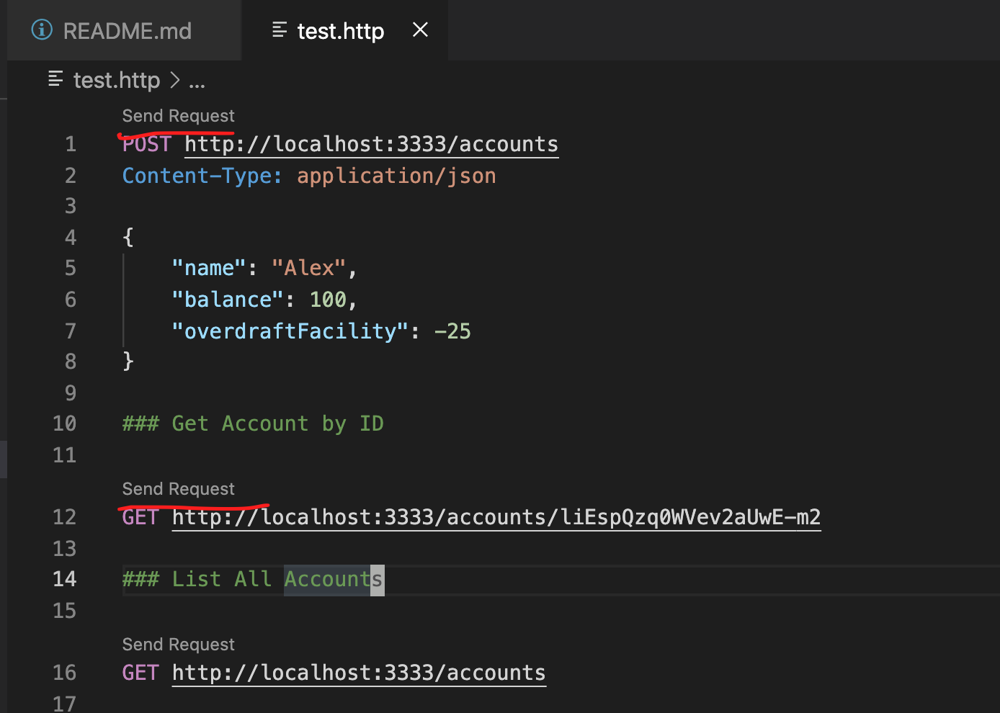

# Codemaster 2020 Banking API

This is a simple REST API for opening up banking accounts and withdrawing/depositing
amounts on them. It serves as an example to the codemaster 2020/21 winter class on
how REST APIs work.

### Installation

1. Run `npm i` in the projects root folder to install all dependencies.
2. Start the server with `npm start`, if you see the message `Server listening on
port 3333` printed, you can safely assume it has properly started.
3. If an error occurs it is most likely that some other application already used 
the port `3333`, therefore go to `api.js` line `82` and change the number to smth
that's free (e.g. `3334`).

### Test the API

The file `test.http` can be opened up in VSCode with the [REST Client](https://marketplace.visualstudio.com/items?itemName=humao.rest-client)
Plugin. It allows you to executed requests like opening up a bank account by clicking on the
`Send Request` label shown above each request:

### Reset the Data

Data is stored in the `banking.json` file. To reset the data just issue the remove command
`rm banking.json` in the projects root folder.